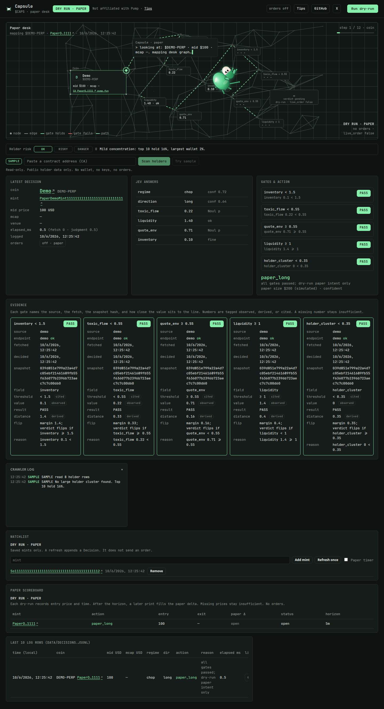
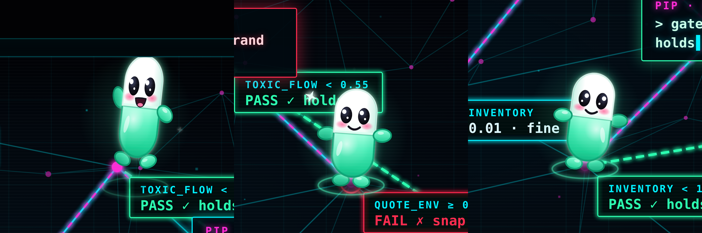

<div align="center">

<pre align="center">
 ██████╗ █████╗ ██████╗ ███████╗██╗   ██╗██╗     ███████╗
██╔════╝██╔══██╗██╔══██╗██╔════╝██║   ██║██║     ██╔════╝
██║     ███████║██████╔╝███████╗██║   ██║██║     █████╗
██║     ██╔══██║██╔═══╝ ╚════██║██║   ██║██║     ██╔══╝
╚██████╗██║  ██║██║     ███████║╚██████╔╝███████╗███████╗
 ╚═════╝╚═╝  ╚═╝╚═╝     ╚══════╝ ╚═════╝ ╚══════╝╚══════╝
              $CAPS · pump desk · dry-run
</pre>

### A live, visual dry-run desk for [pump.fun](https://pump.fun)

`status` &nbsp;🟢 **Shipping** &nbsp;&nbsp; `version` &nbsp;📦 **0.4.0** &nbsp;&nbsp; `license` &nbsp;📄 **Apache-2.0** &nbsp;&nbsp; `mode` &nbsp;🧪 **Dry-run only**

### Built by **[0xPliny](https://x.com/0xPliny)** · tips welcome on X

---

[](https://github.com/0xPliny/Capsule)

</div>

**Capsule** is a local pump.fun desk: public market data in, gated judgment out, a paper graph and a quiet capsule mascot on screen. Deterministic code owns math and risk; optional [TypeSafe](https://typesafe.ai) / Jev calls own the six judgment questions. Fan tool that pays respects to Pump — **not affiliated with, endorsed by, or part of Pump**.

---

## Features

- **Dry-run by design** — no wallet, no trade POSTs, `live_order` is always `false`
- **Public pump.fun data** — coins, trades, and 1m candles over plain GETs
- **Offline demo + replay** — `--demo` and `--replay` never need pump.fun or TypeSafe
- **Paper desk tour** — coin → judgment → gates → action, with a quiet capsule mascot
- **Gate strands** — green PASS / red FAIL on toxic flow, quote environment, liquidity, inventory, each with its own reason
- **Evidence panel** — per gate: source, endpoint, fetch time, decision time, snapshot hash, field, threshold, value, distance to the line, and what would flip it
- **Fail closed** — a failed GET, a timeout, a stale print, or a missing field does not produce a confident intent. The desk says **insufficient data** and names the source and endpoint
- **CA → pump.fun** — mint links open the coin page when a mint is present
- **Header actions** — [Tips](https://x.com/0xPliny) · [GitHub](https://github.com/0xPliny/Capsule) · [X](https://x.com/0xPliny)
- **Phase 4 paper desk** — local watchlist, an optional watch loop, and a paper scoreboard. Still no trades. `live_order` stays `false`
- **Apache-2.0** — use it, fork it, build on it; keep secrets out of the repo

---

## Quick start

### First five minutes

```bash
git clone https://github.com/0xPliny/Capsule.git
cd Capsule

# optional — only if you want live Jev judgment calls
export TYPESAFE_API_KEY=your_key

python desk.py --pump              # latest bonding-curve coin (public GETs)
python desk.py --mint <MINT>       # one specific coin (public GETs)
python desk.py --demo              # offline fake snapshot + canned judgment
python desk.py --replay tests/fixtures/replay_paper_long.jsonl
python desk.py --watch-add <MINT>  # save a mint locally (no network, no order)
python desk.py --watch-list
python desk.py --watch --passes 1  # refresh saved mints, append Decisions, no orders
python desk.py --demo --watch --passes 1   # same loop, fully offline

python dashboard/server.py         # local UI at http://127.0.0.1:8791/
```

The dashboard binds **127.0.0.1 only**, default port **8791** (next free port if 8791 is taken). Override with `CAPSULE_DASH_PORT`.

Open the printed URL → **Run dry-run**. Watch Capsule crawl the graph. **DRY RUN · PAPER** stays in the header.

### Windows

`run.bat` starts the same local dashboard. It uses `.venv\Scripts\python.exe` when that file exists, otherwise `py -3`, otherwise `python`.

```bat
run.bat
set CAPSULE_DASH_PORT=8791 && run.bat
```

The script does not take a trade, does not read a key, and does not listen on anything but localhost. The port is `8791` unless `CAPSULE_DASH_PORT` is already set.

### What “I need to…” maps to

| I need to… | Start here |
| --- | --- |
| See the desk UI | `python dashboard/server.py` or `run.bat` on Windows |
| Score the latest curve coin | `python desk.py --pump` |
| Score a mint I already have | `python desk.py --mint <MINT>` |
| Demo with no network / no API key | `python desk.py --demo` |
| Replay a stored Decision / snapshot | `python desk.py --replay <path.jsonl\|snapshot.json>` |
| Save or drop a watched mint | `python desk.py --watch-add <MINT>` / `--watch-remove <MINT>` |
| Refresh the watchlist once | `python desk.py --watch --passes 1` |
| Run the safety + gate tests | `pip install -r requirements-dev.txt && pytest` |
| Tip the author | [x.com/0xPliny](https://x.com/0xPliny) |

---

## How it works

1. Build a compact market snapshot from a **source**: live pump.fun GETs (`--pump` / `--mint`), the offline demo, or a recorded file (`--replay`).
2. Ask six questions (live TypeSafe / Jev on `--pump` / `--mint`; canned or stored judgment offline): regime, direction, toxic flow, liquidity, quote environment, inventory.
3. Evaluate **all** declarative gates from `thresholds.json` (`default_v1`). Each gate records the field, the threshold, the value, the signed distance to that line, a reason, and what would flip it. Intent policy is still inventory → toxic → quote_env → liquidity → direction → `paper_long` / `paper_short` / hold / flatten — **never** a live order.
4. If a required GET fails or times out, the coin's last trade is older than 15 minutes (`900s`), or a gate field is missing, the intent is `hold` with `confident: false` and a reason that starts `insufficient data:` and names the source and endpoint. Candle HTTP misses are shown on the evidence panel and do not by themselves block a decision that already has price and trades. A candle timeout does block.
5. Log a versioned Decision (`schema_v` **2**, `run_id`, `ts`, `source`, `mint`, `snapshot`, `snapshot_hash`, `endpoints`, `judgment`, per-gate evidence, `intent`, `data_status`, `threshold_set_id`) to `data/decisions.jsonl` (gitignored). Older `schema_v` 1 rows still replay. The dashboard lists every gate, not only the first failure. Gate numbers are tagged **observed** (the print), **derived** (the distance), or **cited** (the threshold). A missing number is marked **insufficient**.
6. Record a paper mark beside that decision: snapshot price and time in, and after the horizon (default 5 minutes) a later print fills the paper delta. No price means no delta. The watchlist lives in `data/watchlist.json`. `--watch` only refreshes saved mints (or `--demo` / one `--mint`) and appends Decisions. It never sends an order.

---

## Phase 4 · paper product

This release is still a dry-run. It does **not** connect a key, does **not** post a trade, and does **not** turn `live_order` on.

| Piece | What it does |
| --- | --- |
| Watchlist | `desk.py --watch-add`, `--watch-remove`, `--watch-list`, and the same list on the local dashboard |
| Watch loop | `--watch` appends `schema_v` 2 Decisions for the saved mints. `--passes 1` is a single pass. The dashboard timer does the same dry-run refresh |
| Paper scoreboard | Entry price and time at the decision; the N-minute print records the paper delta. Missing prices stay insufficient |
| Evidence roles | observed / derived / cited on the numbers the gates already show |
| Honesty strip | **DRY RUN · PAPER** stays in the header, tips stay on [x.com/0xPliny](https://x.com/0xPliny), and the not-affiliated line stays |

<p align="center">
  
</p>

---

## Secrets & safety

- Never commit API keys, wallets, `.env`, or machine paths.
- Set `TYPESAFE_API_KEY` in the environment only.
- This product does **not** place trades. Unlocking live trading is a separate, explicit decision.

---

## Links

| | |
| --- | --- |
| Repository | [github.com/0xPliny/Capsule](https://github.com/0xPliny/Capsule) |
| X / tips | [x.com/0xPliny](https://x.com/0xPliny) |
| License | [Apache-2.0](LICENSE) |

---

## Creator

**Created and maintained by [0xPliny](https://x.com/0xPliny)**.

If Capsule helped you catch a gate snap before real money moved — that’s the point. Issues and PRs welcome.

---

## License

Copyright © 2026 0xPliny.

Licensed under the Apache License, Version 2.0. See [LICENSE](LICENSE).

---

<div align="center">

**Status: Shipping** &nbsp;·&nbsp; **Version 0.4.0** &nbsp;·&nbsp; **Dry-run · live_order false**

*Fan desk for pump.fun. Not Pump. Stay safe.*

</div>
