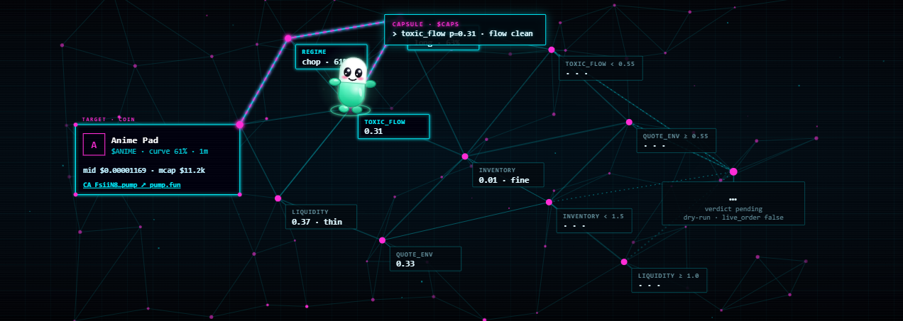

<div align="center">

<pre align="center">
 ██████╗ █████╗ ██████╗ ███████╗██╗   ██╗██╗     ███████╗
██╔════╝██╔══██╗██╔══██╗██╔════╝██║   ██║██║     ██╔════╝
██║     ███████║██████╔╝███████╗██║   ██║██║     █████╗
██║     ██╔══██║██╔═══╝ ╚════██║██║   ██║██║     ██╔══╝
╚██████╗██║  ██║██║     ███████║╚██████╔╝███████╗███████╗
 ╚═════╝╚═╝  ╚═╝╚═╝     ╚══════╝ ╚═════╝ ╚══════╝╚══════╝
              $CAPS · pump desk · dry-run
</pre>

### A live, visual dry-run desk for [pump.fun](https://pump.fun)

`status` &nbsp;🟢 **Shipping** &nbsp;&nbsp; `version` &nbsp;📦 **0.1.0** &nbsp;&nbsp; `license` &nbsp;📄 **Apache-2.0** &nbsp;&nbsp; `mode` &nbsp;🧪 **Dry-run only**

### Built by **[0xPliny](https://x.com/0xPliny)** · tips welcome on X

---

[](https://github.com/0xPliny/Capsule)

</div>

**Capsule** is a local pump.fun desk: public market data in, gated judgment out, neon graph + capsule mascot on screen. Deterministic code owns math and risk; optional [TypeSafe](https://typesafe.ai) / Jev calls own the six judgment questions. Fan tool that pays respects to Pump — **not affiliated with, endorsed by, or part of Pump**.

---

## Features

- **Dry-run by design** — no wallet, no trade POSTs, `live_order` is always `false`
- **Public pump.fun data** — coins, trades, and 1m candles over plain GETs
- **Animated desk tour** — coin → Jev answers → gates → action, with a bright capsule mascot
- **Gate strands** — green PASS / red FAIL on toxic flow, quote environment, liquidity, inventory
- **CA → pump.fun** — mint links open the coin page when a mint is present
- **Header actions** — [Donate](https://x.com/0xPliny) · [GitHub](https://github.com/0xPliny/Capsule) · [X](https://x.com/0xPliny)
- **Apache-2.0** — use it, fork it, build on it; keep secrets out of the repo

<p align="center">
  
</p>

---

## Quick start

### First five minutes

```bash
git clone https://github.com/0xPliny/Capsule.git
cd Capsule

# optional — only if you want live Jev judgment calls
export TYPESAFE_API_KEY=your_key

python desk.py --pump              # latest bonding-curve coin
python desk.py --mint <MINT>       # one specific coin
python desk.py --demo              # offline fake snapshot

python dashboard/server.py         # local UI (often http://127.0.0.1:8792/)
```

Open the printed URL → **Run dry-run**. Watch Capsule crawl the graph.

### What “I need to…” maps to

| I need to… | Start here |
| --- | --- |
| See the desk UI | `python dashboard/server.py` |
| Score the latest curve coin | `python desk.py --pump` |
| Score a mint I already have | `python desk.py --mint <MINT>` |
| Demo with no network / no API key | `python desk.py --demo` |
| Tip the author | [x.com/0xPliny](https://x.com/0xPliny) |

---

## How it works

1. Build a compact market snapshot from public pump.fun endpoints (curve stand-ins for book fields).
2. Ask Jev six questions in one call: regime, direction, toxic flow, liquidity, quote environment, inventory.
3. Apply hard gates in code (probability / score thresholds) → `paper_long` / `paper_short` / hold / flatten — **never** a live order.
4. Log to `data/decisions.jsonl` (gitignored) and animate the tour on the dashboard.

<p align="center">
  
</p>

---

## Secrets & safety

- Never commit API keys, wallets, `.env`, or machine paths.
- Set `TYPESAFE_API_KEY` in the environment only.
- This product does **not** place trades. Unlocking live trading is a separate, explicit decision.

---

## Links

| | |
| --- | --- |
| Repository | [github.com/0xPliny/Capsule](https://github.com/0xPliny/Capsule) |
| X / tips | [x.com/0xPliny](https://x.com/0xPliny) |
| License | [Apache-2.0](LICENSE) |

---

## Creator

**Created and maintained by [0xPliny](https://x.com/0xPliny)** (Chase Logan).

If Capsule helped you catch a gate snap before real money moved — that’s the point. Issues and PRs welcome.

---

## License

Copyright © 2026 Chase Logan / 0xPliny.

Licensed under the Apache License, Version 2.0. See [LICENSE](LICENSE).

---

<div align="center">

**Status: Shipping** &nbsp;·&nbsp; **Version 0.1.0** &nbsp;·&nbsp; **Dry-run · live_order false**

*Fan desk for pump.fun. Not Pump. Stay safe.*

</div>